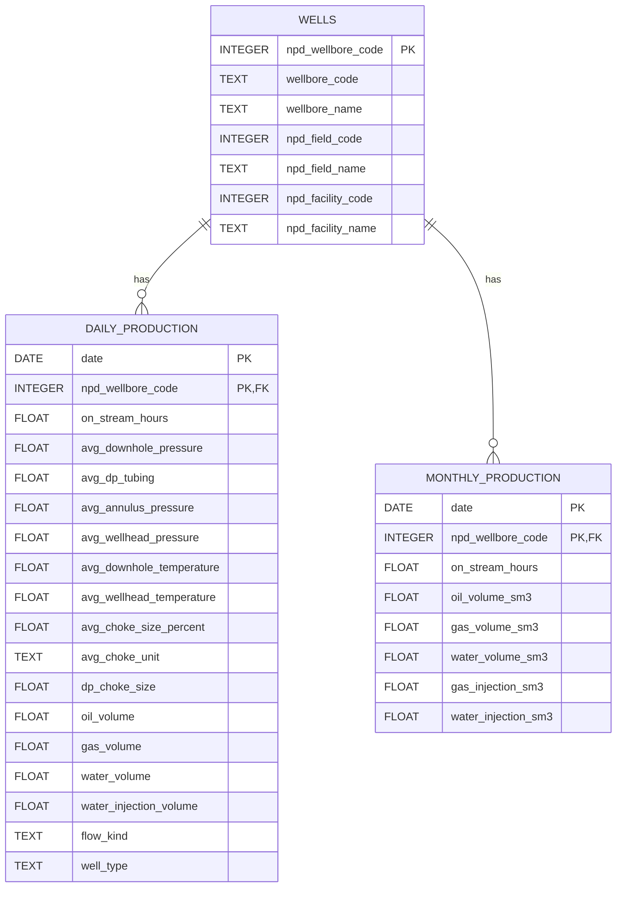
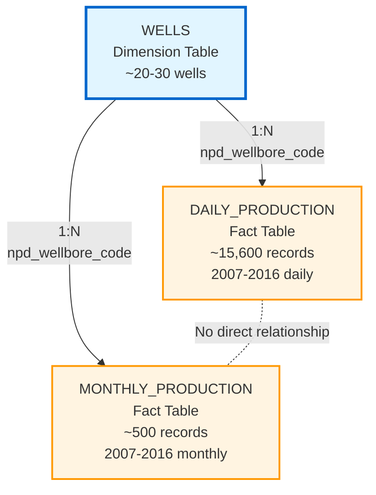
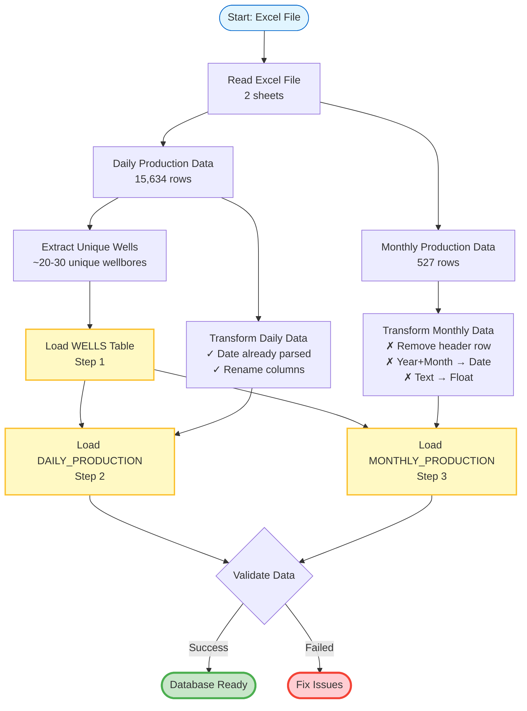

# Volve Production Database Schema

**Created**: 2025-12-28
**Database**: SQLite
**Location**: `database/volve.db`

## Overview

The Volve production database schema consists of three tables designed to store time-series production data from the Equinor Volve oil field:

1. **wells** - Master table (dimension table)
2. **daily_production** - Fact table with daily measurements
3. **monthly_production** - Fact table with monthly aggregates

This is a **star schema** design where the wells table serves as a dimension table, and the two production tables serve as fact tables containing time-series measurements.

---

## Table Relationships

### Entity Relationship Diagram



### Star Schema Visualization



**Key Design Decisions**:

- **No direct relationship** between daily_production and monthly_production
- Both time-series tables reference wells via `npd_wellbore_code`
- Composite primary keys on time-series tables: `(date, npd_wellbore_code)`
- Foreign key constraints ensure referential integrity

---

## Table 1: wells (Master/Dimension Table)

### Purpose
Contains one row per unique wellbore in the Volve field. Stores static attributes that do not change over time.

### Schema

| Column Name | Type | Constraints | Description |
|------------|------|-------------|-------------|
| `npd_wellbore_code` | INTEGER | PRIMARY KEY | NPD unique wellbore identifier |
| `wellbore_code` | TEXT | NOT NULL | Well bore code (e.g., "NO 15/9-F-1 C") |
| `wellbore_name` | TEXT | NOT NULL | NPD well bore name |
| `npd_field_code` | INTEGER | NOT NULL | NPD field code (3420717 for Volve) |
| `npd_field_name` | TEXT | NOT NULL | Field name |
| `npd_facility_code` | INTEGER | NOT NULL | NPD facility code |
| `npd_facility_name` | TEXT | NOT NULL | Facility name |

### Primary Key
- `npd_wellbore_code`

### Indexes
- None (primary key provides implicit index)

### Example Row
```sql
npd_wellbore_code: 7405
wellbore_code: "NO 15/9-F-1 C"
wellbore_name: "15/9-F-1 C"
npd_field_code: 3420717
npd_field_name: "VOLVE"
npd_facility_code: 123456
npd_facility_name: "Volve Platform"
```

### Notes
- This table should be populated first (before fact tables)
- Contains only time-independent attributes
- Well type is NOT included (it can change over time, e.g., producer → injector)

---

## Table 2: daily_production (Fact Table)

### Purpose
Contains daily production measurements and operational metrics for each wellbore. One row per day per well.

### Schema

| Column Name | Type | Constraints | Description |
|------------|------|-------------|-------------|
| `date` | DATE | PRIMARY KEY (composite) | Production date |
| `npd_wellbore_code` | INTEGER | PRIMARY KEY (composite), FOREIGN KEY → wells | Well identifier |
| **Operational Metrics** |
| `on_stream_hours` | FLOAT | | Hours the well was producing |
| `avg_downhole_pressure` | FLOAT | | Average downhole pressure |
| `avg_dp_tubing` | FLOAT | | Average differential pressure in tubing |
| `avg_annulus_pressure` | FLOAT | | Average annulus pressure |
| `avg_wellhead_pressure` | FLOAT | | Average wellhead pressure |
| `avg_downhole_temperature` | FLOAT | | Average downhole temperature |
| `avg_wellhead_temperature` | FLOAT | | Average wellhead temperature |
| `avg_choke_size_percent` | FLOAT | | Average choke size as percentage |
| `avg_choke_unit` | TEXT | | Choke unit of measurement |
| `dp_choke_size` | FLOAT | | Differential pressure choke size |
| **Production Volumes** |
| `oil_volume` | FLOAT | | Oil volume produced from bore |
| `gas_volume` | FLOAT | | Gas volume produced from bore |
| `water_volume` | FLOAT | | Water volume produced from bore |
| `water_injection_volume` | FLOAT | | Water injection volume (injection wells) |
| **Classification** |
| `flow_kind` | TEXT | | Type of flow (e.g., "production") |
| `well_type` | TEXT | | Well type ("OP" = oil producer, "WI" = water injector) |

### Primary Key
- Composite: `(date, npd_wellbore_code)`

### Foreign Keys
- `npd_wellbore_code` → `wells.npd_wellbore_code`

### Indexes
- `ix_daily_date` on `date` - Optimizes date range queries
- `ix_daily_wellbore` on `npd_wellbore_code` - Optimizes well-specific queries
- Primary key provides implicit index on `(date, npd_wellbore_code)`

### Example Row
```sql
date: 2014-04-07
npd_wellbore_code: 7405
on_stream_hours: 23.5
avg_downhole_pressure: 250.3
oil_volume: 1234.56
gas_volume: 5678.90
water_volume: 123.45
well_type: "OP"
flow_kind: "production"
```

### Data Quality Notes
- Approximately 40-50% of operational metrics are NULL (sensor data not available)
- Water injection volume only populated for water injection wells
- Some water volumes are negative (corrections/adjustments)

---

## Table 3: monthly_production (Fact Table)

### Purpose
Contains monthly production aggregates for each wellbore. One row per month per well.

### Schema

| Column Name | Type | Constraints | Description |
|------------|------|-------------|-------------|
| `date` | DATE | PRIMARY KEY (composite) | First day of month (YYYY-MM-01) |
| `npd_wellbore_code` | INTEGER | PRIMARY KEY (composite), FOREIGN KEY → wells | Well identifier |
| `on_stream_hours` | FLOAT | | Total hours on stream for the month |
| `oil_volume_sm3` | FLOAT | | Oil volume produced (Sm3) |
| `gas_volume_sm3` | FLOAT | | Gas volume produced (Sm3) |
| `water_volume_sm3` | FLOAT | | Water volume produced (Sm3) |
| `gas_injection_sm3` | FLOAT | | Gas injection volume (Sm3) |
| `water_injection_sm3` | FLOAT | | Water injection volume (Sm3) |

### Primary Key
- Composite: `(date, npd_wellbore_code)`

### Foreign Keys
- `npd_wellbore_code` → `wells.npd_wellbore_code`

### Indexes
- `ix_monthly_date` on `date` - Optimizes date range queries
- `ix_monthly_wellbore` on `npd_wellbore_code` - Optimizes well-specific queries
- Primary key provides implicit index on `(date, npd_wellbore_code)`

### Example Row
```sql
date: 2014-04-01
npd_wellbore_code: 7405
on_stream_hours: 720.0
oil_volume_sm3: 45123.67
gas_volume_sm3: 1597936.65
water_volume_sm3: 0.0
gas_injection_sm3: NULL
water_injection_sm3: NULL
```

### Data Quality Notes
- Date represents the **first day of the month** (e.g., 2014-04-01 for April 2014)
- Gas injection is almost always NULL (99.8% missing)
- Water injection only populated for injection wells (61.7% missing)
- ~40% of production volumes are NULL (non-producing months or shut-in periods)

### Units
- **Sm3**: Standard cubic meters (at standard temperature and pressure)

---

## Query Patterns

### 1. Get all production for a specific well
```sql
-- Using explicit SQL with SQLAlchemy Core
SELECT w.wellbore_name, d.date, d.oil_volume, d.gas_volume
FROM wells w
JOIN daily_production d ON w.npd_wellbore_code = d.npd_wellbore_code
WHERE w.npd_wellbore_code = 7405
ORDER BY d.date;
```

### 2. Monthly production summary across all wells
```sql
SELECT
    w.wellbore_name,
    m.date,
    m.oil_volume_sm3,
    m.gas_volume_sm3
FROM wells w
JOIN monthly_production m ON w.npd_wellbore_code = m.npd_wellbore_code
WHERE m.date BETWEEN '2014-01-01' AND '2014-12-01'
ORDER BY m.date, w.wellbore_name;
```

### 3. Compare daily vs monthly aggregates
```sql
-- Daily sum for a month
SELECT
    strftime('%Y-%m', d.date) as year_month,
    SUM(d.oil_volume) as daily_oil_sum
FROM daily_production d
WHERE npd_wellbore_code = 7405
GROUP BY year_month;

-- Monthly data
SELECT
    m.date,
    m.oil_volume_sm3 as monthly_oil
FROM monthly_production m
WHERE npd_wellbore_code = 7405;
```

### 4. Find water injection wells
```sql
SELECT DISTINCT w.*
FROM wells w
JOIN daily_production d ON w.npd_wellbore_code = d.npd_wellbore_code
WHERE d.well_type = 'WI';
```

---

## Data Integrity Constraints

### Referential Integrity
- All `npd_wellbore_code` values in `daily_production` must exist in `wells`
- All `npd_wellbore_code` values in `monthly_production` must exist in `wells`
- Enforced via FOREIGN KEY constraints

### Primary Key Constraints
- No duplicate (date, npd_wellbore_code) pairs in `daily_production`
- No duplicate (date, npd_wellbore_code) pairs in `monthly_production`
- No duplicate `npd_wellbore_code` in `wells`

### Data Type Constraints
- Dates must be valid DATE values
- Numeric columns must be valid FLOAT or INTEGER values
- NULL values allowed for most metrics (sensor data may be missing)

---

## Transformation Pipeline

### ETL Process Flow



### Loading Order (Important!)

1. **First**: Load `wells` table
   - Extract unique wells from source data
   - Populate dimension table

2. **Second**: Load `daily_production` table
   - Reference existing wells via foreign key
   - Convert date formats

3. **Third**: Load `monthly_production` table
   - Reference existing wells via foreign key
   - Construct date from year + month
   - Convert text volumes to numeric

### Source Data Mapping

**wells table** ← Derived from daily production data (unique wells):
- Source: `Daily Production Data` sheet
- Extract unique combinations of well attributes
- One-time population

**daily_production table** ← Direct mapping:
- Source: `Daily Production Data` sheet
- Date already in correct format
- Rename columns to snake_case

**monthly_production table** ← Requires transformation:
- Source: `Monthly Production Data` sheet
- **Remove row 0** (contains units, not data)
- Convert Year + Month → DATE (first day of month)
- Convert text volumes → FLOAT
- Handle NULL values

---

## Performance Considerations

### Indexes
- **Date indexes**: Speed up time-range queries (common in time-series analysis)
- **Wellbore indexes**: Speed up well-specific queries
- **Composite PK**: Automatically indexed, supports efficient lookups

### Expected Data Volumes
- **wells**: ~20-30 rows (small dimension table)
- **daily_production**: ~15,600 rows (9+ years × ~30 wells)
- **monthly_production**: ~500 rows (9+ years × ~6 wells × 12 months)

### Query Optimization Tips
1. Always filter on indexed columns (date, npd_wellbore_code)
2. Use date ranges instead of full table scans
3. Consider well_type filter early in WHERE clause
4. Aggregate at database level before pulling into Python

---

## Database File

**Location**: `database/volve.db`

**Size**: ~5-10 MB (after loading all data)

**Backup**: Consider versioning the database file or keeping transformation scripts for reproducibility

---

## Next Steps

1. **Populate wells table**: Extract unique wells from source data
2. **Load daily_production**: Direct transformation from Excel
3. **Load monthly_production**: Clean and transform Excel data
4. **Validate data**: Check row counts, date ranges, foreign key integrity
5. **Create views**: Consider creating SQL views for common queries
6. **Document queries**: Build a library of example queries for analysis

---

## Educational Notes

This schema demonstrates several database design principles:

1. **Normalization**: Separating dimension (wells) from facts (production) reduces redundancy
2. **Star Schema**: Classic data warehouse pattern (1 dimension, 2 fact tables)
3. **Time-Series Design**: Composite keys with date enable efficient time-based queries
4. **Referential Integrity**: Foreign keys ensure data consistency
5. **Indexing Strategy**: Indexes on commonly-filtered columns improve query performance
6. **Denormalization Trade-off**: Could further normalize (separate field/facility tables), but this adds complexity without much benefit for this dataset size
